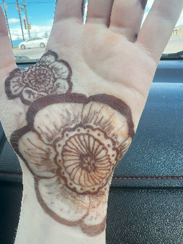
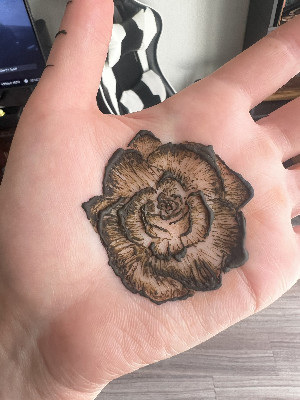

Celebrate your birthday with a henna design of your birth flower! Whether you want to book a henna artist for your party or a custom design for yourself, the timeless beauty of henna is a fun way to celebrate special occasions. 

Henna and Jagua cones are sourced from The Henna Lady at 10DayInk, who partners with farmers in India and Peru. There are only four ingredients: henna powder, lemon juice, sugar, and essential oil. 

  
  
  
  
  
  
  
  
  
  
  
    <a href="assets/images/poppy.png" data-lightbox="gallery">
    
        

