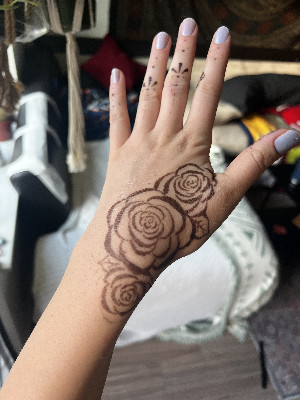
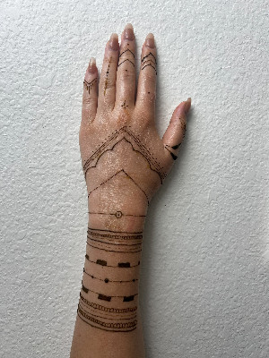
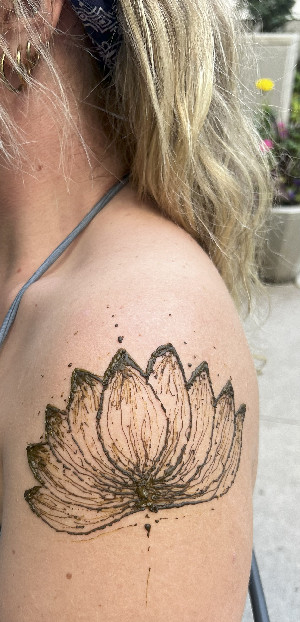

Whether you’re celebrating a special occasion or simply honoring yourself, my goal is to help you feel adorned, radiant, and empowered through the timeless beauty of henna.

For thousands of years, henna has been cherished across cultures—as a natural dye, a blessing for weddings, a ritual of protection, and a way to celebrate beauty.

As a Caucasian henna artist, I place great importance on honoring the cultures and traditions from which henna originates. My love for body art began as a child, when I would doodle on myself and others with markers and pens. That passion grew when my aunt introduced me to henna as a safe, natural way to create art on skin. Over the years, as I explored other art forms, henna called me back—especially once I began working with natural, high-quality henna from The Henna Lady and fell in love with the practice.

Today, I source my cones from The Henna Lady at 10DayInk, who partners with farmers in India and Peru. Henna powder comes from the Lawsonia inermis plant, a shrub that thrives in warm climates such as India, Egypt, and North Africa. My henna paste contains only four ingredients: henna powder, lemon juice, sugar, and essential oil. I also work with jagua gel, a deep blue-black stain made from the Genipa americana fruit, native to South America.

  
  
  
  

  
  
  
  
  
  
  
  
  
  
   
   
  
  
  
   

